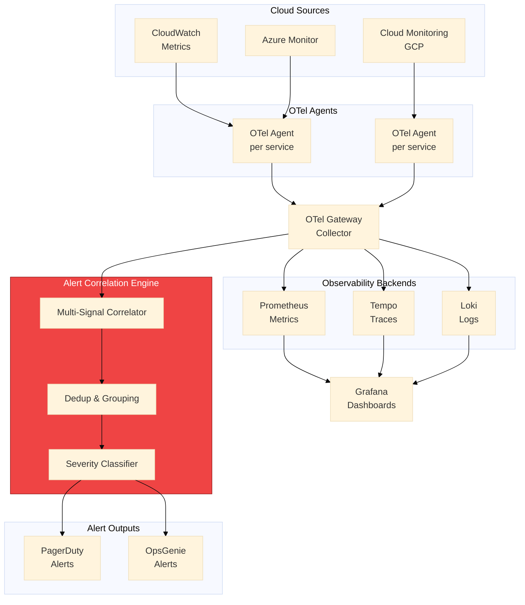

# Multi-Cloud Observability Platform

**Unified Observability Across AWS, Azure, and GCP**

[](https://go.dev)
[](https://opentelemetry.io)
[](https://prometheus.io)
[](https://grafana.com)
[](LICENSE)

A production-ready observability platform that aggregates metrics, traces, and logs from multi-cloud environments into unified dashboards with intelligent alerting.

## What This Solves

**The Problem:** Multi-cloud environments create observability fragmentation:
- Metrics scattered across CloudWatch, Azure Monitor, Cloud Monitoring
- No unified view of application health across clouds
- Alert fatigue from multiple, uncoordinated alerting systems
- Difficulty tracing requests across cloud boundaries

**The Solution:** Unified observability with:
- OpenTelemetry Collector for vendor-neutral telemetry collection
- Prometheus for metrics aggregation and alerting
- Grafana for unified dashboards and visualization
- Distributed tracing across cloud boundaries
- Intelligent alert correlation and routing

## Architecture



## Features

### Metrics Collection
- AWS CloudWatch metrics via CloudWatch Exporter
- Azure Monitor metrics via Azure Monitor Exporter
- GCP Cloud Monitoring via Stackdriver Exporter
- Application metrics via OpenTelemetry SDK
- Custom business metrics support

### Distributed Tracing
- Cross-cloud trace propagation
- Service dependency mapping
- Latency analysis and bottleneck detection
- Error tracking with full context

### Log Aggregation
- CloudWatch Logs integration
- Azure Log Analytics integration
- Cloud Logging integration
- Structured logging with correlation IDs

### Intelligent Alerting
- Multi-signal alert correlation
- PagerDuty/OpsGenie integration
- Runbook automation links
- Alert deduplication and grouping

## Project Structure

```
multicloud-observability/
├── cmd/
│   └── collector/
│       └── main.go              # Custom OTel collector with multi-cloud receivers
├── internal/
│   ├── otel/
│   │   ├── config.go            # OTel collector configuration
│   │   └── processors.go        # Custom processors (cloud enrichment)
│   ├── metrics/
│   │   ├── aws_exporter.go      # CloudWatch metrics receiver
│   │   ├── azure_exporter.go    # Azure Monitor metrics receiver
│   │   └── gcp_exporter.go      # Cloud Monitoring metrics receiver
│   ├── traces/
│   │   └── propagation.go       # Cross-cloud trace propagation
│   ├── alerts/
│   │   ├── correlator.go        # Alert correlation logic
│   │   ├── pagerduty.go         # PagerDuty integration
│   │   └── opsgenie.go          # OpsGenie integration
│   └── dashboards/
│       └── generator.go         # Programmatic dashboard generation
├── configs/
│   ├── otel-collector.yaml      # OpenTelemetry Collector config
│   ├── prometheus.yaml          # Prometheus configuration
│   └── alertmanager.yaml        # Alertmanager configuration
├── deployments/
│   └── k8s/
│       ├── otel-collector.yaml  # Kubernetes deployment
│       ├── prometheus.yaml      # Prometheus StatefulSet
│       └── grafana.yaml         # Grafana deployment
├── dashboards/
│   ├── multicloud-overview.json # Main overview dashboard
│   ├── service-health.json      # Service health dashboard
│   └── cost-performance.json    # Cost vs performance correlation
├── go.mod
└── README.md
```

## Quick Start

### Prerequisites
- Go 1.21+
- Kubernetes cluster (or Docker Compose for local)
- Cloud credentials with monitoring read access

### Local Development

```bash
# Clone repository
git clone https://github.com/lvonguyen/multicloud-observability.git
cd multicloud-observability

# Start local stack (Prometheus, Grafana, Tempo, Loki)
docker-compose up -d

# Run collector with cloud exporters
export AWS_PROFILE=monitoring-readonly
export AZURE_SUBSCRIPTION_ID=your-subscription
export GCP_PROJECT_ID=your-project

go run ./cmd/collector --config configs/otel-collector.yaml
```

### Kubernetes Deployment

```bash
# Create namespace
kubectl create namespace observability

# Deploy OpenTelemetry Collector
kubectl apply -f deployments/k8s/otel-collector.yaml

# Deploy Prometheus
kubectl apply -f deployments/k8s/prometheus.yaml

# Deploy Grafana
kubectl apply -f deployments/k8s/grafana.yaml

# Access Grafana
kubectl port-forward -n observability svc/grafana 3000:3000
```

## Configuration

### Cloud Credentials

| Cloud | Method | Required Permissions |
|-------|--------|---------------------|
| AWS | IRSA / IAM Role | cloudwatch:GetMetricData, logs:GetLogEvents |
| Azure | Managed Identity | Monitoring Reader role |
| GCP | Workload Identity | roles/monitoring.viewer |

### Metrics Configuration

```yaml
# configs/otel-collector.yaml
receivers:
  awscloudwatch:
    region: us-east-1
    poll_interval: 60s
    metrics:
      - namespace: AWS/EC2
        metric_name: CPUUtilization
        period: 60s
        stat: Average
      - namespace: AWS/Lambda
        metric_name: Duration
        period: 60s
        stat: p99

  azuremonitor:
    subscription_id: ${AZURE_SUBSCRIPTION_ID}
    resource_groups:
      - production-rg
    metrics:
      - resource_type: Microsoft.Compute/virtualMachines
        metric_names:
          - Percentage CPU
          - Network In Total

  googlecloudmonitoring:
    project: ${GCP_PROJECT_ID}
    metrics:
      - type: compute.googleapis.com/instance/cpu/utilization
```

## Key Metrics

### Golden Signals by Cloud

| Signal | AWS Metric | Azure Metric | GCP Metric |
|--------|-----------|--------------|------------|
| Latency | X-Ray p99 | App Insights | Cloud Trace |
| Traffic | ALB RequestCount | AppGw Requests | LB Requests |
| Errors | 5xx Count | Failed Requests | Error Rate |
| Saturation | CPU/Memory | Resource Usage | Utilization |

## Use Cases

1. **Observability Engineering**
   - OpenTelemetry adoption and custom collector development
   - Multi-signal observability (metrics, traces, logs)
   - SLI/SLO definition and measurement

2. **Multi-Cloud Architecture**
   - Unified monitoring across cloud providers
   - Vendor-neutral telemetry collection
   - Cross-cloud correlation and tracing

3. **SRE Practices**
   - Alerting strategy and on-call optimization
   - Incident response automation
   - Service level management

4. **Platform Engineering**
   - Self-service observability for development teams
   - Programmatic dashboard generation
   - GitOps for monitoring configuration

## Related Projects

- [cspm-aggregator](https://github.com/lvonguyen/cspm-aggregator) - Security findings aggregation
- [CloudForge](https://github.com/lvonguyen/cloudforge) - Policy enforcement platform
- [finops-platform](https://github.com/lvonguyen/finops-platform) - Cost management

## License

MIT License - See [LICENSE](LICENSE)

## Author

**Liem Vo-Nguyen**
- LinkedIn: [linkedin.com/in/liemvonguyen](https://linkedin.com/in/liemvonguyen)
- Email: liem@vonguyen.io

---

*Multi-Cloud Observability Platform — production-grade SRE and platform engineering for multi-cloud environments.*

